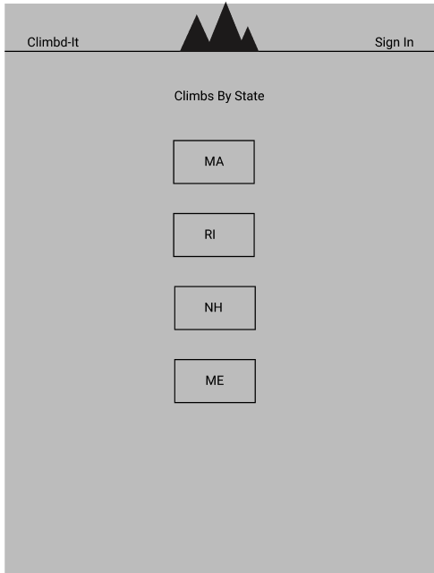
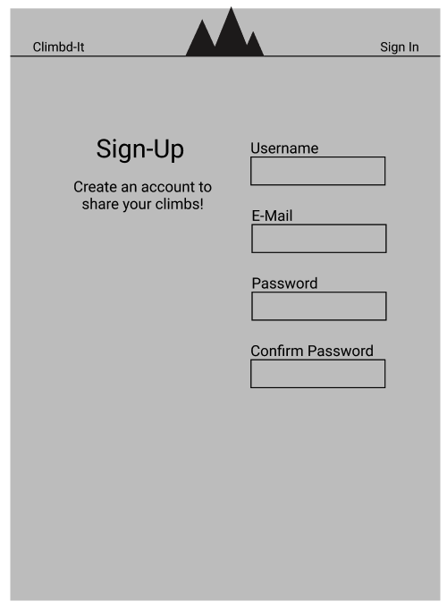
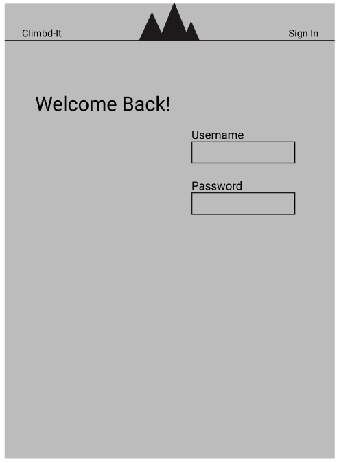
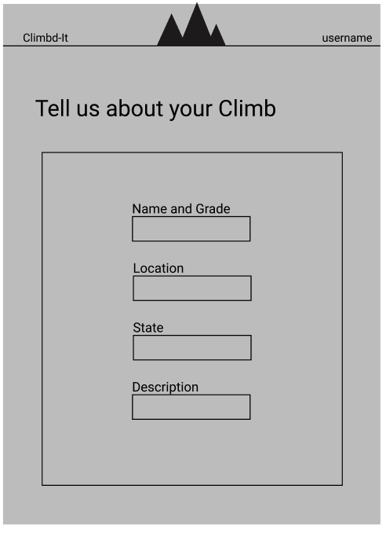
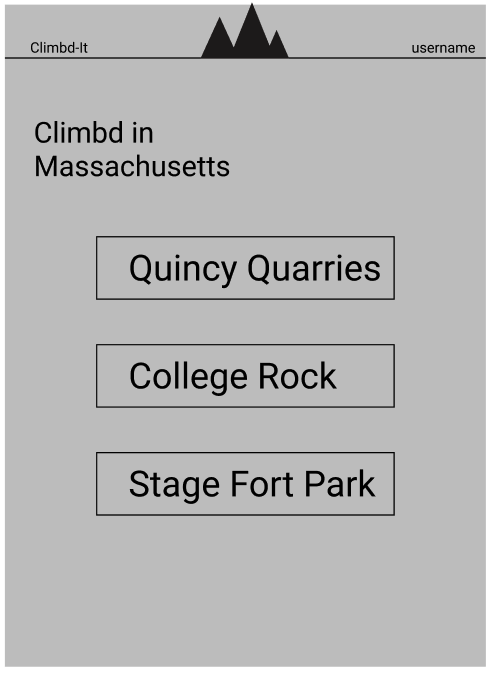
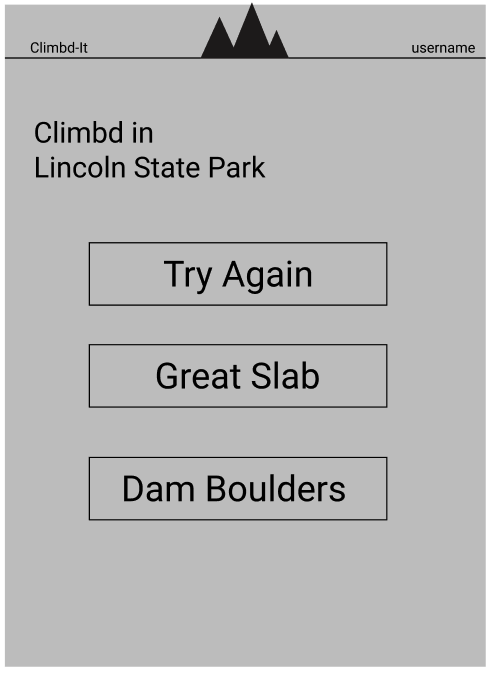
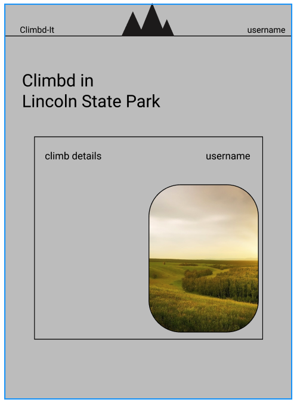
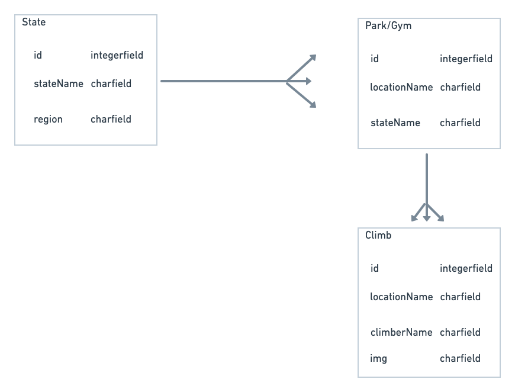

# Climbd-It

Project 4 - Velvet Worms SEI

## Description

'Climbd It' will be a hub where climbers can log their outdoor adventures. Users will be able to post the name of the climb itself, and a picture of said climb. Climbs will be categorized by geographic location (State, and Park/Gym therein).

## Components List

- Nav
- Layout
- Footer
- Sign-Up
- Sign-In
- Post
- Edit
- Climbs-by-State
- Climbs-by-location
- Climbs Detail Page

## Wireframes

## Entity Relationship Diagram

